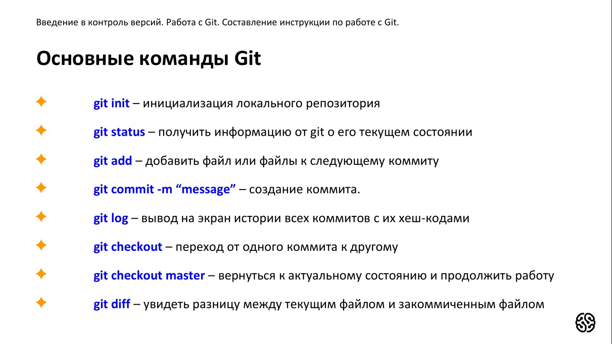
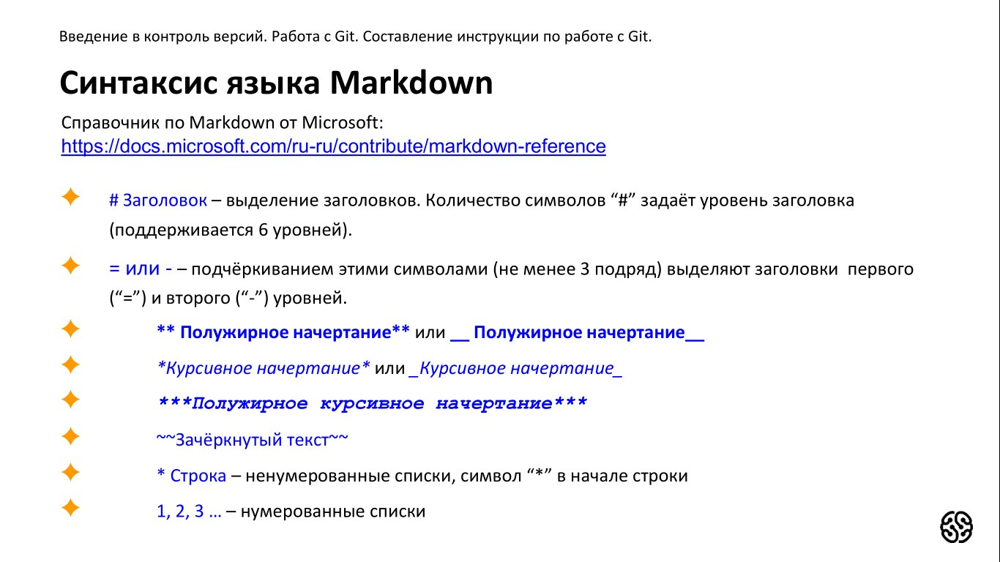

# Инструкция для работы с Git и удалёнными репозиториями

## Что такое Git?
Git - это одна из реализаций распределённых систем контроля версий, имеющая как и локальные, так и удалённые репозитории. Является самой популярной реализацией систем контроля версий в мире.
## Подготовка репозитория
Для создание репозитория необходимо выполнить команду *git init*  в папке с репозиторием и у Вас создаться репозиторий (появится скрытая папка .git)

## Создание коммитов

### Git add
Для добавления измений в коммит используется команда *git add*. Чтобы использовать команду *git add* напишите *git add <имя файла>*

### Просмотр состояния репозитория
Для того, чтобы посмотреть состояние репозитория используется команда *git status*. Для этого необходимо в папке с репозиторием написать *git status*, и Вы увидите были ли измения в файлах, или их не было.

### Создание коммитов
Для того, чтобы создать коммит(сохранение) необходимо выполнить команду *git commit*. Выполняется она так: *git commit -m "<сообщение к коммиту>*. Все файлы для коммита должны быть ***ДОБАВЛЕНЫ*** и сообщение к коммиту писать ***ОБЯЗАТЕЛЬНО***.

## Перемещение между сохранениями
Для того, чтобы перемещаться между коммитами, используется команда *git checkout*. Используется она в папке с репозиторием следующим образом: *git checkout <номер коммита>*

## Журнал изменений
Для того, чтобы посмотреть все сделанные изменения в репозитории, используется команда *git log*. Для этого достаточно выполнить команду *git log* в папке с репозиторием

## Ветки в Git

### Создание ветки

Для того, чтобы создать ветку, используется команда *git branch*. Делается это следующим образом в папке с репозиторием: *git branch <название новой ветки>*

## Слияние веток

Для того чтобы дабавить ветку в текущую ветку используется команда *git merge <name branch>*

## Удаление веток
Для удаления ветки ввести команду "git branch -d 'name branch'"
## Работа с изображениями
Как правило, изображения и большие файлы не добавляют в git. Можно создать отдельный файл .gitignore, в нем записать файлы, которые необходимо игнорировать и в статусе уже не будет отображаться информация о них.
## Основные команды Git

## Язык Markdown

## Работа с удаленным репозиторием

1. Создали аккаунт на гитхаб
2. создать локальный репозиторий
3. "Подружить" локальный и удаленный репозиторий
4. отправить (push) ваш локальный репозиторий в удаленный (на гитхаб), при этом, возможно, авторизоваться на удаленном репозитории.
5. Провести изменения с "другого" компьютера
6. Выкачать (pull) актуальное состояние из удаленного репозитория

## Поучаствовать в чужом проекте

1. делаем форк интересующего нас реп
2. делаем гит клон для нашей версии этого реп-рия
3. создаем ветку с предлагаемыми изменениями
4. производим все изм только в этой ветке
5. отправляем эти изм на свой аккаунт (пуш)
6. в окне на гитхаб появляется возможность отправить пулл реквест
7. Отправляем пулл реквест